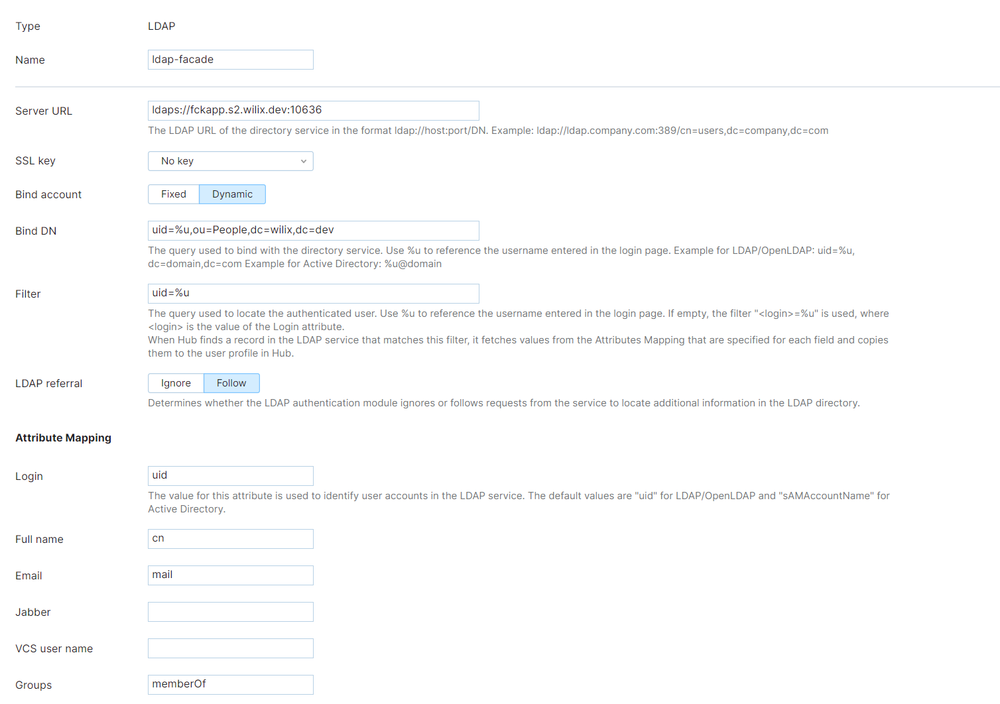

# crm-ldap-dacade

ldap авторизация для CRM пользователей
##### Запуск контейнера
```sh
docker run --name facade -p 10636:10636 crm-ldap-facade:1.0.0
```
## Подготовка хранилища для ключей.

Подготовка пары ключ-сертификат в формате PKCS12
```$bash
openssl pkcs12 -export -in fullchain1.pem -inkey privkey1.pem -out keystore.p12 -name s2.wilix.dev -CAfile isrgrootx1.pem -caname letsencrypt
```

Импортирование в Java Key Store формат
```bash
keytool -importkeystore -deststorepass <passwd> -destkeypass <passwd> -destkeystore .keystore -srckeystore keystore.p12 -srcstoretype PKCS12 -srcstorepass <наш пароль для keystore.p12> -alias myhostname
```

После этого можно пользоваться хранилищем на стороне сервера.

Если сертификат не подписан, то требуются дополнительные подготовительные работы на стороне клиента.

## Запуск.

TODO
```bash
 LISTENER_PORT=10637 LISTENER_KEYSTOREPATH='C:\Users\Van\sandbox\certs\fck.keystore' LISTENER_KEYSTOREPASS=wilix1234 java -Xmx20m -jar crm-ldap-facade-1.0-SNAPSHOT.jar
```

# Примерные настройки для клиента ldap аутентификации

