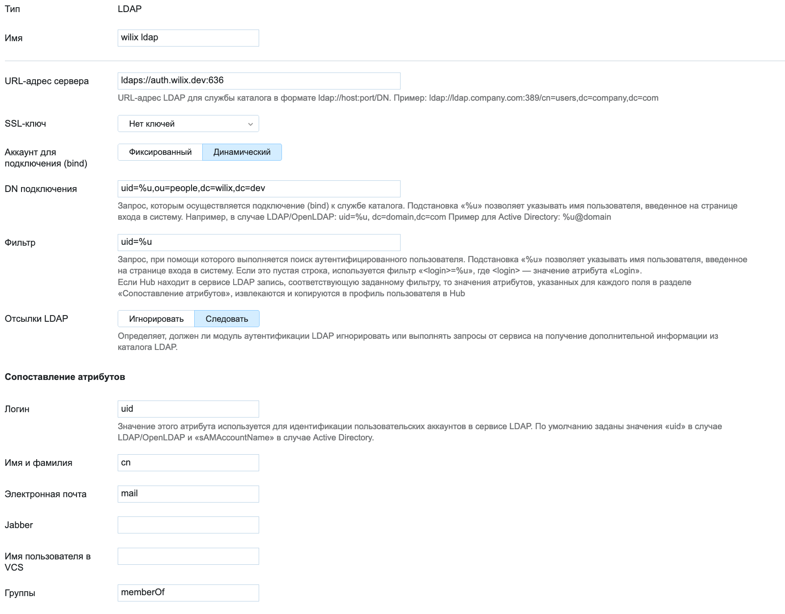

# crm-ldap-facade

ldap авторизация для CRM пользователей

## Подготовка хранилища для ключей.

Подготовка пары ключ-сертификат в формате PKCS12
```$bash
openssl pkcs12 -export -in fullchain1.pem -inkey privkey1.pem -out keystore.p12 -name s2.wilix.dev -CAfile isrgrootx1.pem -caname letsencrypt
```

Импортирование в Java Key Store формат
```bash
keytool -importkeystore -deststorepass <passwd> -destkeypass <passwd> -destkeystore .keystore -srckeystore keystore.p12 -srcstoretype PKCS12 -srcstorepass <наш пароль для keystore.p12> -alias myhostname
```

После этого можно пользоваться хранилищем на стороне сервера.

Если сертификат не подписан, то требуются дополнительные подготовительные работы на стороне клиента.

## Запуск.

```bash
 LISTENER_PORT=10637 LISTENER_KEYSTOREPATH='C:\Users\Van\sandbox\certs\fck.keystore' LISTENER_KEYSTOREPASS=wilix1234 java -Xmx20m -jar crm-ldap-facade-1.0-SNAPSHOT.jar
```

##### Запуск в docker контейнере
1. Собрать образ 
```bash
grandlew clean build docker
```
2. Или получить из приватного репозитория компании готовый образ (docker.wilix.dev)
3. Запустить образ. Требуется не забыть в контейнер пробросить хранилище ключей, сформированное ранее.
```bash
docker run --name ldap-facade -p 10636:10636 crm-ldap-facade:1.0.0
```

# Примерные настройки для клиента ldap аутентификации в youtrack



#### Ограничения

Существует ограничение на сложность фильтров в запросах на поиск записей.
Внутри приложения производится простой поиск для атрибутов имени и класса на одно-единственное вхождение.
Т.е. сложные фильтры, которые содержат несколько условий для одного имени атрибута не будут корректно работать.

## Настройка публикации библиотек в удалённый Maven репозиторий

Для публикации библиотек в удалённый репозиторий и возможности их последующего подтягивания в другой проект необходимо в build.gradle корневого проекта добавить:

1. Указать группу и версию. Например
```
group 'dev.wilix.ldap-facade'
version '1.0.0-SNAPSHOT'
```
2. Добавить в тела plugins и в subprojects плагин "maven-publish".
3. В subprojects добавить получение версии и группы проекта.
```
group = rootProject.group
version = rootProject.version
```
4. Добавить имя пользователя и пароль в файл настроек "gradle.properties", находящемся по пути "C:\Users\{userLocalName}\.gradle\".
```
mavenUser=someUsername
mavenPassword=somePassword
```
5. Добавить в subprojects задачу publishing, где в качестве url записывается путь к репозиторию, куда следует выложить библиотеки. 
```
publishing {
        publications {
            mavenJava(MavenPublication) {
                from components.java
            }
        }
        repositories {
            maven {
                if (version.toString().endsWith("SNAPSHOT")) {
                    url 'https://artifacts.wilix.dev/repository/maven-snapshots/'
                }
                else {
                    url 'https://artifacts.wilix.dev/repository/maven-releases/'
                }
                credentials {
                    username "$mavenUser"
                    password "$mavenPassword"
                }
            }
        }
    }
```
6. Для выбора необходимых библиотек для публикации включить их в "settings.gradle". Например:
```
include 'server'
```   
7. Для публикации библиотек запустить задачу "publish".

## Настройка загрузки внешних библиотек из удалённого Maven репозитория в проект

1. Добавить плагин "maven-publish".
2. Указать репозиторий. Например:
```
repositories {
    maven {
        url 'https://artifacts.wilix.dev/repository/maven-snapshots/'
    }
    mavenCentral()
}
```
3. Установить зависимости. Например:
```
    implementation group: 'dev.wilix.ldap-facade', name: 'server', version: '1.0.0-SNAPSHOT'
```
